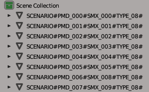

# RE4-2007-SCENARIO-SMD-TOOL
Extract and repack RE4 2007 scenario smd/pmd files

Translate from Portuguese Brazil

Programas destinados a extrair e recompactar os cenários usando somente um arquivo .OBJ

## Update B.1.0.1.2
Update de melhorias, agora será criado também o arquivo .idxpmdmaterial, que é responsável por editar os conteúdos do material/textura;
 agora, ao fazer repack a ordem das meches é definida pelo nome do material/grupo;

## Update B.1.0.0.2
Corrigido bug no qual não era rotacionado as normals dos modelos que têm rotação,
então, caso esteja usando um .obj de versões anteriores, recalcule as normals;

## Update B.1.0.0.1
Adicionado compatibilidade com outros editores 3D que não suportam caracteres especiais #: como, por exemplo, o 3dsMax;
  Adicionado também uma verificação no nome dos grupos, então caso esteja errado o nome, o programa avisa-rá;
  Os arquivos da versão anterior são compatíveis com essa versão;

 ## RE4_2007_SCENARIO_SMD_EXTRACT.exe

Programa destinado para extrair o cenário, em um arquivo bat use o seguinte comando:
 Extract Scenario:
 RE4_2007_SCENARIO_SMD_EXTRACT.exe ".smd File patch" "Pmds Files folder" "Pmd base name"

Exemplo:
 RE4_2007_SCENARIO_SMD_EXTRACT.exe "D:\Games\Re4\st2\r209\r209_04.SMD" "D:\Games\Re4\xscr\r209" "r209"

nesse exemplo será gerado os arquivos na pasta : D:\Games\Re4\xscr\r209

* r209.scenario.idxscenario  // arquivo importante de configurações;
* r209.scenario.obj // conteúdo de todo o cenário, esse é o arquivo que você vai editar;
* r209.scenario.mtl // arquivo que acompanha o .obj;
* r209.scenario.idxpmdmaterial // Arquivo alternativo para editar os materiais;
* r209.scenario.DrawDistance.obj // arquivo informacional, mas não é utilizado no repack.
* r209.scenario.reference.smd // arquivo informacional, mas não é utilizado no repack.

**Sobre rXXX.scenario.obj**
 Esse arquivo é onde esta todo o cenário, nele os arquivos PMD são reparados por grupos, no qual é nomenclatura deve ser respeitada:
  Exemplo:
  SCENARIO#PMD_000#SMX_001#TYPE_09#
  SCENARIO#PMD_001#SMX_002#TYPE_09#

Sendo:
* É obrigatório o nome do grupo começar com "SCENARIO", e ser divido por #
* PMD_000 esse é o ID do arquivo .PMD, a numeração é em decimal
* SMX_001 esse é o ID do SMX, veja o arquivo .SMX,  a numeração é em decimal
* TYPE_09 esse não sei oque é, a numeração é em hexadecimal.
* o nome do grupo deve terminar com # (pois depois de salvo o arquivo, o blender coloca mais texto no final do nome do grupo)

----> No Update B.1.0.0.1, o nome dos objetos/grupos também pode ser:
  SCENARIO\_PMD\_000\_SMX\_001\_TYPE\_09\_
  SCENARIO\_PMD\_001\_SMX\_002\_TYPE\_09\_

 ----> Sobre verificações de grupos:
  * No Repack se ao lado direito do nome do grupo aparecer o texto "The group name is wrong;", significa que o nome do grupo está errado, e o seu arquivo SMD vai ficar errado;
  * E se ao lado direito aparecer "Warning: Group not used;" esse grupo esta sendo ignorado pelo meu programa, caso, na verdade, você gostaria de usá-lo, você deve arrumar o nome do grupo;

**Editando o arquivo .obj no Blender**
 No importador de .obj marque a caixa "Split By Group" que esta no lado direto da tela.
 Com o arquivo importado, cada objeto representa um arquivo .PMD
 
 Nota: caso você tenha problema com texturas transparente ficando pretas use esse plugin: (**[link](https://github.com/JADERLINK/Blender_Transparency_Fix_Plugin)**) 

**Ao salvar o arquivo**
 Marque as caixas "Triangulated Mesh" e "Object Groups" e "Colors".
  no arquivo .obj o nome dos grupos vão ficar com "_Mesh" no final do nome (por isso no editor termina o nome do grupo com # para evitar problemas)

## RE4_2007_SCENARIO_SMD_REPACK.exe
Faz o repack do cenário, recebe como parâmetro o arquivo ".idxscenario", 
 que no exemplo seria o arquivo "r209.scenario.idxscenario"
 e na pasta deve ter os arquivos "r209.scenario.obj" e " r209.scenario.mtl"
  e como resultado ira gerar os arquivos:
* r209_000.pmd, r209_001.pmd, r209_002.pmd, r209_003.pmd, ate o ultimo que vai ate r209_126.pmd (nesse exemplo)
* e o arquivo "r209_04.SMD", no qual esse arquivo você deve colocar na pasta "D:\Games\Re4\st2\r209" e recompilar o seu arquivo .DAT

**Sobre rXXX.scenario.idxscenario**
 segue a baixo a lista de comando mais importantes presente no arquivo:

* SmdAmount:127 // representa a quantidade de entradas/arquivos Smd/Pmd (você pode mudar mas em alguns cenário pode esta crashando o jogo)
* SmdFileName:r209_04.SMD // esse é o nome do arquivo Smd que será gerado
* PmdBaseName:r209 // esse é o nome base para os arquivos Pmd
* UseIdxPmdMaterial:False // Define se é usado o arquivo .idxpmdmaterial;
* os outros comando que começam com números são auto descritivos (o numero é o ID do Pmd/Smd) (evite mexer nesses valores)

## DrawDistance
caso o seu modelo fique muito longe da posição original, ele pode começa a aparecer e desaparecer, isso é por causa dos valores que definem a que distancia os modelos iram ser vistos.
  mude os valores de "xxx_DrawDistanceNegative*" para -327670
  e os valores de "xxx_DrawDistancePositive*:" para 655340
  isso vai garantir que o modelo fique visível, porem pode gerar um bug na iluminação.
  Updade B.1.0.0.1, mudei o arquivo "r209.scenario.DrawDistance.obj", para representação correta, pois "xxx_DrawDistancePositive*" não é uma posição, mas sim deve ser somado com "xxx_DrawDistanceNegative" para ter a segunda posição correta;

## bugs
ao mudar os valores originais dos campos "xxx_scale*", "xxx_angle*", "xxx_position*", "xxx_DrawDistanceNegative*" e "xxx_DrawDistancePositive*", pode ocasionar um bug na iluminação do modelo, no qual não sei como resolver.
  caso você souber como resolver esse problema favor entrar em contato.

## Código de terceiro:

[ObjLoader by chrisjansson](https://github.com/chrisjansson/ObjLoader):
Encontra-se no RE4_PMD_Repack, código modificado, as modificações podem ser vistas aqui: [link](https://github.com/JADERLINK/ObjLoader).

**At.te: JADERLINK**
 2024-03-03
